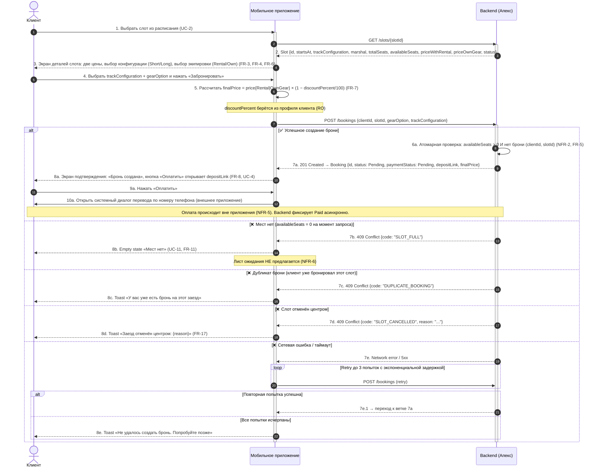

# Sequence-диаграмма: Create Booking (UC-3)

> **Источник:** `04-use-cases.md` (UC-3, UC-11), `02-functional-requirements.md` (FR-3…FR-9), `03-non-functional-requirements.md` (NFR-1, NFR-2), `domain-description.md` (§4.4, §5, §6.1, §6.2).
> **Контекст:** сквозной сценарий создания брони одним клиентом на один слот с учётом всех альтернативных потоков, зафиксированных в требованиях.
> **Акторы:**
> - **Client** — пользователь приложения.
> - **App** — клиентское мобильное приложение (роль «Клиент»).
> - **Backend** — black-box источник истины (NFR-1).

---

## 1. Диаграмма


# Create Booking — альтернативные потоки, контракт API и проектные решения

> **Связанный артефакт:** `01-analysis/4-design/api-sequence.md` — основная sequence-диаграмма UC-3.
> **Источник требований:** `04-use-cases.md` (UC-3, UC-11), `02-functional-requirements.md` (FR-3…FR-9), `03-non-functional-requirements.md` (NFR-1, NFR-2), `domain-description.md` (§4.4, §5, §6.1, §6.2).
> **Контекст:** документ детализирует альтернативные потоки сценария создания брони, фиксирует минимальный контракт API для UC-3 и перечисляет ключевые проектные решения, принятые при проектировании.

---

## 2. Описание альтернативных потоков

| Ветка | Условие | Действие приложения | Ссылка на требование |
|---|---|---|---|
| **7a — Успех** | `availableSeats > 0` и нет активной брони `(clientId, slotId)` | Показать экран подтверждения с `depositLink` | FR-5, FR-8, NFR-2 |
| **7b — Мест нет** | Бэкенд вернул `SLOT_FULL` | Empty state «Мест нет», без листа ожидания | UC-11, FR-11, NFR-6 |
| **7c — Дубликат** | Бэкенд вернул `DUPLICATE_BOOKING` | Toast «У вас уже есть бронь на этот заезд» | FR-5 |
| **7d — Слот отменён** | Бэкенд вернул `SLOT_CANCELLED` | Toast с причиной отмены | FR-17, UC-6 |
| **7e — Сеть/5xx** | Таймаут или 5xx | Retry до 3 раз; при неудаче — toast с ошибкой | NFR-1 |

---

## 3. Контракт API (минимальный скоуп для UC-3)

### 3.1. `GET /slots/{slotId}`

**Ответ 200:**
```json
{
  "id": "slot-uuid",
  "startsAt": "2026-07-06T18:00:00Z",
  "endsAt": "2026-07-06T18:30:00Z",
  "trackConfiguration": "Short",
  "marshalId": "marshal-uuid",
  "marshalName": "Алексей",
  "totalSeats": 8,
  "availableSeats": 3,
  "priceWithRental": 1500.00,
  "priceOwnGear": 1000.00,
  "status": "Open",
  "cancellationReason": null
}
```
### 3.2. POST /bookings
```json
{
  "clientId": "client-phone-79990000000",
  "slotId": "slot-uuid",
  "trackConfiguration": "Short",
  "gearOption": "Rental"
}
```
**Ответ 201 (успех):**
```json
{
  "id": "booking-uuid",
  "clientId": "client-phone-7999000000",
  "slotId": "slot-uuid",
  "gearOption": "Rental",
  "trackConfiguration": "Short",
  "finalPrice": 1350.00,
  "depositLink": "https://pay.example.com/transfer/abc123",
  "paymentStatus": "Pending",
  "status": "Created",
  "rated": false
}
```
**Ответ 409 (ошибка):**
```json
{
  "code": "SLOT_FULL" | "DUPLICATE_BOOKING" | "SLOT_CANCELLED",
  "message": "Человеконечитаемое описание",
  "cancellationReason": "Плохая погода"
}
```
## 4. Ключевые проектные решения, зафиксированные в диаграмме

1. **Приложение не проверяет `availableSeats` самостоятельно** — окончательное решение принимает бэкенд атомарно (NFR-2). Даже если на шаге 2 клиент видел `availableSeats = 1`, к моменту `POST /bookings` слот может быть занят.
2. **`finalPrice` рассчитывается на стороне приложения** для отображения, но бэкенд пересчитывает и фиксирует свою версию при создании брони (FR-7, NFR-11).
3. **Оплата происходит вне приложения** — приложение только открывает `depositLink` в системном диалоге перевода (NFR-5). Переход `Pending → Paid` инициируется бэкендом асинхронно (отдельный сценарий, не в рамках этой диаграммы).
4. **Лист ожидания отсутствует** — при `SLOT_FULL` приложение показывает empty state без предложения подписаться (NFR-6).
5. **Retry-политика** — до 3 попыток с экспоненциальной задержкой; это покрывает требование корректно обрабатывать отказы бэкенда (NFR-1).
6. **Дубликат брони и отмена слота центром** — отдельные бизнес-ошибки с разными кодами, чтобы UI мог показать разный текст (FR-5, FR-17).

---

## 5. Связанные сценарии (не входят в эту диаграмму)

- **UC-4 «Оплата депозита»** — начинается после шага 10a; включает polling/webhook подтверждения оплаты бэкендом.
- **UC-5 «Отмена брони клиентом»** — отдельная sequence с проверкой `now + 2h ≤ startsAt`.
- **UC-6 «Отмена заезда центром»** — пассивный сценарий: приложение получает push и обновляет статус брони.

Эти сценарии описываются отдельными диаграммами при необходимости.