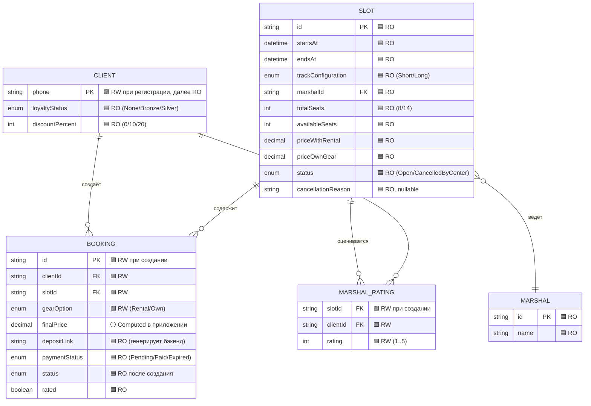

# ER-модель данных — клиентское приложение «Картинг-центр „Апекс"»

> **Источник:** `domain-description.md` (раздел 4 «Ключевые сущности»), `02-functional-requirements.md`, `03-non-functional-requirements.md`.
> **Контекст:** модель описывает данные, с которыми оперирует **клиентское мобильное приложение**. Бэкенд рассматривается как black-box источник истины (NFR-1).
> **Условные обозначения:**
> - 🟦 **RO (Read-Only)** — приложение только читает данные, они приходят из бэкенда и не изменяются клиентом напрямую.
> - 🟩 **RW (Read-Write)** — приложение инициирует создание или изменение данных (отправляет запросы на бэкенд).
> - ⚪ **Computed** — вычисляемое значение на стороне приложения (не хранится как персистентный атрибут сущности на бэкенде, но отображается клиенту).

---

## 1. ER-диаграмма

---

## 2. Сущности и атрибуты

### 2.1. Client (Клиент)

| Атрибут | Тип | RW/RO | Описание |
|---|---|---|---|
| `phone` | string | 🟩 RW | Номер телефона — единственный идентификатор. Создаётся при SMS-регистрации (UC-1, FR-1). Далее — RO. |
| `loyaltyStatus` | enum | 🟦 RO | `None` / `Bronze` / `Silver`. Приходит из бэкенда (NFR-11). |
| `discountPercent` | int | 🟦 RO | `0` / `10` / `20`. Приходит из бэкенда, используется для расчёта `finalPrice`. |

### 2.2. Slot (Заезд / Слот расписания)

| Атрибут | Тип | RW/RO | Описание |
|---|---|---|---|
| `id` | string (UUID) | 🟦 RO | Уникальный идентификатор слота. |
| `startsAt` | datetime | 🟦 RO | Дата и время старта. |
| `endsAt` | datetime | 🟦 RO | Расчётное время окончания (с учётом инструктажа). |
| `trackConfiguration` | enum | 🟦 RO | `Short` / `Long`. Выбор клиента сохраняется в брони, а не в слоте. |
| `marshalId` | string (FK → Marshal) | 🟦 RO | Назначенный маршал-инструктор. |
| `totalSeats` | int | 🟦 RO | Макс. количество клиентов (8 для Short, 14 для Long). |
| `availableSeats` | int | 🟦 RO | Свободных мест на момент запроса. Атомарно контролируется бэкендом (NFR-2). |
| `priceWithRental` | decimal | 🟦 RO | Цена с прокатной экипировкой (FR-6). |
| `priceOwnGear` | decimal | 🟦 RO | Цена со своей экипировкой (FR-6). |
| `status` | enum | 🟦 RO | `Open` / `CancelledByCenter`. |
| `cancellationReason` | string? | 🟦 RO | Заполняется при `status = CancelledByCenter` (FR-17). |

### 2.3. Marshal (Маршал)

| Атрибут | Тип | RW/RO | Описание |
|---|---|---|---|
| `id` | string (UUID) | 🟦 RO | Идентификатор маршала. |
| `name` | string | 🟦 RO | Имя для отображения в карточке слота. Публичный рейтинг не выводится (FR-18). |

> Маршал как роль и его интерфейсы — вне скоупа текущей поставки (NFR-10). В клиентском приложении существует только как атрибут слота.

### 2.4. Booking (Бронь)

| Атрибут | Тип | RW/RO | Описание |
|---|---|---|---|
| `id` | string (UUID) | 🟩 RW | Уникальный идентификатор. Создаётся приложением (UC-3). |
| `clientId` | string (FK → Client) | 🟩 RW | Ссылка на клиента. |
| `slotId` | string (FK → Slot) | 🟩 RW | Ссылка на слот. Ограничение: 1 клиент = 1 бронь на слот (FR-5). |
| `gearOption` | enum | 🟩 RW | `Rental` / `Own`. Выбор клиента (FR-4). |
| `finalPrice` | decimal | ⚪ Computed | Итоговая цена = `price{Rental|OwnGear}` × (1 − `discountPercent`/100). Вычисляется приложением, отображается клиенту (FR-7). |
| `depositLink` | string | 🟦 RO | Ссылка на перевод по номеру телефона. Генерируется бэкендом после создания брони (FR-8). |
| `paymentStatus` | enum | 🟦 RO | `Pending` / `Paid` / `Expired`. Фиксируется бэкендом по факту оплаты (FR-9). |
| `status` | enum | 🟦 RO | Жизненный цикл: `Created` → `Paid` → `Completed` / `CancelledByClient` / `CancelledByCenter`. Переходы инициируются бэкендом (FR-9, §5). |
| `rated` | boolean | 🟦 RO | Флаг: оставлена ли оценка маршалу. Обновляется бэкендом после отправки `MarshalRating`. |

### 2.5. MarshalRating (Оценка маршала)

| Атрибут | Тип | RW/RO | Описание |
|---|---|---|---|
| `slotId` | string (FK → Slot) | 🟩 RW | Заезд, к которому относится оценка. |
| `clientId` | string (FK → Client) | 🟩 RW | Клиент, оставляющий оценку. |
| `rating` | int (1..5) | 🟩 RW | Целое число — «звёздочки». Текстовый комментарий не предусмотрен (FR-14). |

> Составной ключ: `(slotId, clientId)` — один клиент может оценить слот только один раз.

---

## 3. Связи между сущностями

| Связь | Кратность | Описание |
|---|---|---|
| `Client` → `Booking` | 1 : * | Один клиент может иметь много броней (в разных слотах). |
| `Slot` → `Booking` | 1 : * | Один слот содержит много броней (до `totalSeats`). |
| `Client` × `Slot` → `Booking` | (1, 1) : 1 | Ограничение уникальности: один клиент — одна бронь в одном слоте (FR-5). Контролируется бэкендом (NFR-2). |
| `Slot` → `Marshal` | * : 1 | Несколько слотов ведут один маршал; один слот — один маршал. |
| `Slot` → `MarshalRating` | 1 : * | Один слот может получить много оценок от разных клиентов. |
| `Client` → `MarshalRating` | 1 : * | Один клиент может оценить несколько слотов. |
| `Client` × `Slot` → `MarshalRating` | (1, 1) : 1 | Один клиент — одна оценка на слот. |

---

## 4. Границы ответственности: приложение vs бэкенд

| Операция | Инициатор | Хранитель истины |
|---|---|---|
| Создание клиента (SMS-регистрация) | Приложение | Бэкенд |
| Формирование расписания слотов | Бэкенд | Бэкенд |
| Атомарная проверка свободных мест | Бэкенд | Бэкенд |
| Создание брони | Приложение | Бэкенд |
| Расчёт `finalPrice` (скидка лояльности) | Приложение (отображение) | Бэкенд (персистент) |
| Генерация `depositLink` | Бэкенд | Бэкенд |
| Фиксация оплаты (`paymentStatus = Paid`) | Бэкенд | Бэкенд |
| Переход `Paid` → `Completed` (по времени) | Бэкенд | Бэкенд |
| Отмена брони клиентом (с проверкой `now + 2h ≤ startsAt`) | Приложение (UI-блокировка) + Бэкенд (валидация) | Бэкенд |
| Отмена центром (`CancelledByCenter`) | Бэкенд | Бэкенд |
| Отправка оценки маршалу | Приложение | Бэкенд |
| Отправка push-уведомлений | Бэкенд (триггер) | — |
| Начисление статусов лояльности | Бэкенд | Бэкенд |

---

## 5. Примечания к модели

1. **Отсутствие сущностей «Конфигурация трассы» и «Вариант экипировки».** `trackConfiguration` и `gearOption` — это enum-атрибуты слота и брони соответственно, а не отдельные справочники. В текущем скоупе значения фиксированы (`Short`/`Long`, `Rental`/`Own`) и не требуют нормализации.
2. **`finalPrice` — вычисляемое поле.** Не хранится как отдельный атрибут на стороне приложения в персистентном виде, но отображается клиенту на основе `price{Rental|OwnGear}` × (1 − `discountPercent`/100). На бэкенде может сохраняться для истории.
3. **`depositLink` — RO для приложения.** Источник (бэкенд или приложение-генератор) уточняется в контракте API; с точки зрения клиентской модели — это read-only поле брони.
4. **Публичный рейтинг маршала отсутствует в модели.** Оценки (`MarshalRating`) существуют только для внутренней аналитики владельца (FR-18), поэтому агрегированное поле `averageRating` в сущности `Marshal` не заводится.
5. **Waivers, возрастные/медицинские ограничения, лист ожидания** — осознанно отсутствуют в модели (NFR-6, NFR-7, §8).