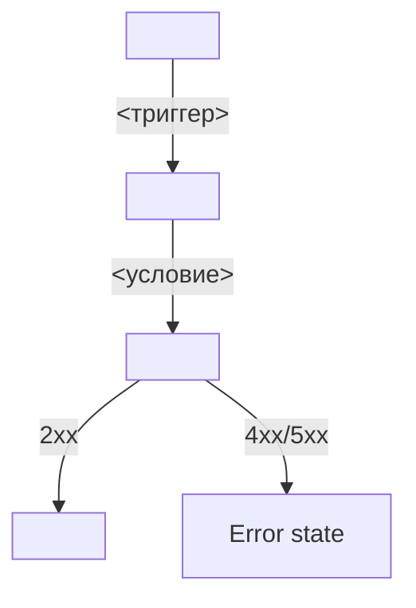

# <FLOW-XXX>: <Название флоу>

> Шаблон технического описания сквозной логики клиентского приложения «Апекс».
> Описывает пользовательский сценарий, который может пересекать несколько экранов (SCR) и шторок (BS).
> Заполняется на основе `00-foundations.md`, `design-brief.md`, `data-model.md`, OpenAPI-контракта (`api/`) и спецификаций экранов.
> Перед сдачей — пройти чек-лист в §12 «Критерии приёмки».

---

## 1. Метаданные

| Поле | Значение |
|---|---|
| **Идентификатор** | `<FLOW-XXX>` |
| **Связанный Use Case** | `<UC-X>` |
| **Связанные User Stories** | `<US-X, US-Y>` |
| **Владелец** | `<ФИО, роль>` |
| **Статус** | Draft / In Review / Approved / Implemented |
| **Дата создания** | `ГГГГ-ММ-ДД` |
| **Дата последнего обновления** | `ГГГГ-ММ-ДД` |
| **Затрагиваемые экраны** | `<SCR-XXX, BS-XXX, …>` |

---

## 2. История изменений

| Версия | Дата | Автор | Описание изменений |
|---|---|---|---|
| 0.1 | `ГГГГ-ММ-ДД` | `<автор>` | Первичная черновая версия |
| 0.2 | `ГГГГ-ММ-ДД` | `<автор>` | `<что и почему изменено>` |

---

## 3. Назначение и контекст

### 3.1. Краткое описание
<!-- 2–4 предложения: что это за сценарий, какую бизнес-задачу решает. -->
<Описание>

### 3.2. Пользовательская цель
<!-- В формате «<роль> хочет <действие>, чтобы <результат>». -->
<Как клиент, я хочу …, чтобы …>

### 3.3. Бизнес-ценность
<!-- Почему этот флоу важен для картинг-центра. Связь с BR-x. -->
<Описание ценности.>

### 3.4. Контекст запуска
- **Точка входа:** <тап по CTA / push-триггер / deeplink / старт приложения>
- **Сессия:** авторизован / не авторизован
- **Сеть:** обязательна / опциональна
- **Время / условия:** <опционально>

---

## 4. Участники флоу

<!-- Все экраны, шторки и внешние системы, через которые проходит сценарий. -->

| Участник | Тип | Роль в флоу | Спецификация |
|---|---|---|---|
| `<SCR-XXX>` | Screen | <роль> | `<ссылка>` |
| `<BS-XXX>` | Bottom Sheet | <роль> | `<ссылка>` |
| `External (банк / СБП)` | External | <роль> | — |
| `Push-уведомление` | Trigger | <роль> | — |

---

## 5. Предусловия и постусловия

### 5.1. Предусловия (entry conditions)
<!-- Что должно быть истинным ДО старта флоу. -->
- [ ] <условие 1>
- [ ] <условие 2>

### 5.2. Постусловия (exit conditions)
<!-- Что должно быть истинным после успешного завершения флоу. -->
- [ ] <сущность> в состоянии `<status>`
- [ ] Пользователь находится на экране `<SCR-XXX>`
- [ ] <push / уведомление отправлено>

### 5.3. Точки выхода (exit points)
<!-- Все возможные завершения флоу — не только успешные. -->

| Точка выхода | Условие | Финальное состояние |
|---|---|---|
| Успех | <условие> | <SCR-XXX, сущность в статусе …> |
| Отмена пользователем | <условие> | возврат к `<SCR-XXX>` без изменений |
| Ошибка сети | <условие> | экран Error с CTA «Повторить» |
| Отказ бэкенда | <код ответа> | inline-ошибка / bottom sheet |
| Таймаут | <условие> | <состояние> |

---

## 6. Граф переходов

### 6.1. Happy path (основной сценарий)
<!-- Нумерованный список шагов. Каждый шаг — атомарное действие. -->

1. **Пользователь** <действие>.
2. **Приложение** <реакция: запрос к API / переход на экран>.
3. **Бэкенд** <ответ / изменение состояния>.
4. **UI** <обновление>.

### 6.2. Альтернативные пути (alternative flows)
<!-- Ветвления, которые отклоняются от happy path. -->

#### A1. <Название ветки>
- Условие входа: <когда запускается>
- Шаги:
    1. …
    2. …
- Возврат в happy path: <на каком шаге> / <завершение флоу>

#### A2. <Название ветки>
…

### 6.3. Диаграмма (опционально)
<!-- Mermaid / ASCII-схема для сложных флоу. -->

---

## 7. Используемые API

<!-- Все эндпоинты, задействованные в флоу. Ссылки на `api/<домен>/api.yaml`. -->

| # | Метод | Endpoint | Назначение в флоу | Успешный код | Обрабатываемые ошибки |
|---|---|---|---|---|---|
| 1 | `POST` | `api/auth/api.yaml → /auth/sms/send` | <роль> | 202 | 400, 429 |
| 2 | `POST` | `api/bookings/api.yaml → /bookings` | <роль> | 201 | 400, 409, 410 |
| 3 | `POST` | `api/bookings/api.yaml → /bookings/{id}/cancel` | <роль> | 200 | 404, 422 |

### 7.1. Последовательность вызовов
<!-- Если вызовы зависят друг от друга — зафиксировать порядок. -->
1. Вызов #1 → при успехе → вызов #2.
2. Вызов #3 выполняется параллельно / последовательно.

### 7.2. Идемпотентность и повторные попытки
<!-- Какие вызовы можно безопасно повторять. -->
- Вызов #1: идемпотентен / не идемпотентен — <обоснование>.
- Повтор при сетевой ошибке: <да/нет, стратегия>.

---

## 8. Состояния данных

<!-- Какие сущности из `data-model.md` меняются в ходе флоу. -->

| Сущность | Начальное состояние | Конечное состояние (успех) | Кто меняет |
|---|---|---|---|
| `Client` | — | — | — |
| `Booking` | не существует | `status = Paid` | Бэкенд |
| `Slot.availableSeats` | N | N − 1 | Бэкенд (атомарно, NFR-2) |

### 8.1. Источники истины
<!-- Напоминание: бэкенд — источник истины (NFR-1). -->
- Все персистентные изменения — на стороне бэкенда.
- Приложение не выполняет клиентских вычислений, которые могут разойтись с бэкендом (кроме UI-отображения `finalPrice`, FR-7).

---

## 9. Обработка ошибок

### 9.1. Сетевые ошибки
| Ситуация | Поведение |
|---|---|
| Нет соединения при старте флоу | Экран «Нет соединения» (00-foundations §4.2) |
| Потеря связи в середине флоу | Inline-ошибка + CTA «Повторить»; состояние не теряется |
| Таймаут (> 10 с) | Переход в Error state (00-foundations §4.1) |

### 9.2. Ошибки бэкенда
| Код | Смысл | Поведение приложения |
|---|---|---|
| `400` | Некорректный запрос | Inline-ошибка с текстом из `message` |
| `401` | Истёк токен | Редирект на `SCR-001` |
| `404` | Ресурс не найден | <описание> |
| `409` | Конфликт (race condition) | <описание> |
| `410` | Ресурс удалён (слот отменён) | <описание> |
| `422` | Бизнес-правило нарушено | <описание> |
| `429` | Rate limit | Показать `retryAfterSeconds`, заблокировать CTA |
| `5xx` | Ошибка сервера | Error state + CTA «Повторить» |

### 9.3. Race conditions
<!-- Конкурентные сценарии, учтённые в design-review §3.2. -->

| # | Сценарий | Обработка |
|---|---|---|
| 1 | <например, «мест нет» во время создания брони> | <код ответа + UI-реакция> |
| 2 | <например, слот отменён центром во время бронирования> | <код ответа + UI-реакция> |

---

## 10. Edge cases

<!-- Заполняется на основе `design-review.md §3`. -->

| # | Сценарий | Поведение флоу |
|---|---|---|
| 1 | `<edge case>` | `<реакция>` |
| 2 | `<edge case>` | `<реакция>` |

### 10.1. Явные ограничения скоупа
<!-- Что этот флоу НЕ делает, хотя может показаться, что должен. -->
- <Ограничение 1> (ссылка на NFR/FR)
- <Ограничение 2>

---

## 11. Требования (traceability)

### 11.1. Functional Requirements
| ID | Формулировка | Как покрыто в флоу |
|---|---|---|
| FR-X | «…» | <шаг N, API #M> |

### 11.2. Non-Functional Requirements
| ID | Формулировка | Как обеспечено |
|---|---|---|
| NFR-X | «…» | <механизм> |

### 11.3. Use Cases
| ID | Название | Роль флоу |
|---|---|---|
| UC-X | <название> | основной / альтернативный flow |

### 11.4. User Stories
| ID | Формулировка |
|---|---|
| US-X | «Как <роль>, я хочу <действие>, чтобы <ценность>» |

---

## 12. Критерии приёмки (DoD)

<!-- Чек-лист. Все пункты должны быть выполнены для перевода флоу в статус Implemented. -->

### 12.1. Функциональные
- [ ] Happy path (§6.1) воспроизводится от начала до конца.
- [ ] Все альтернативные пути (§6.2) реализованы и проверяются.
- [ ] Все точки выхода (§5.3) достигаются при соответствующих условиях.
- [ ] Все API-вызовы (§7) выполняются в правильном порядке.

### 12.2. Данные и API
- [ ] Все коды ответов (§7, §9.2) корректно обрабатываются.
- [ ] Race conditions (§9.3) воспроизводимо обрабатываются.
- [ ] Состояния данных (§8) переходят в ожидаемые значения после успеха.
- [ ] Нет клиентских вычислений там, где источник истины — бэкенд (NFR-1).

### 12.3. UX и доступность
- [ ] Соблюдён Tone of Voice (`00-foundations §5`) во всех пользовательских сообщениях.
- [ ] Все Error / Empty states реализованы согласно `00-foundations §4`.
- [ ] Переходы между экранами соответствуют карте навигации (`design-brief.md §2`).
- [ ] Поддержка VoiceOver / TalkBack для ключевых шагов.

### 12.4. Edge cases
- [ ] Все сценарии из §10 реализованы.
- [ ] Все edge cases из `design-review.md §3`, релевантные этому флоу, учтены.

### 12.5. Traceability
- [ ] Все FR, NFR, US, UC из §11 покрыты.
- [ ] Нет ссылок на требования вне скоупа (NFR-5…NFR-10, FR-18).

---

## 13. Приложения

- Диаграммы последовательностей (Sequence Diagram): `<ссылки>`
- Скриншоты ключевых состояний: `<ссылки>`
- Смежные артефакты: `<SCR-XXX.md, BS-XXX.md, api/<домен>/api.yaml>`

---

## Приложение A. Подсказки по заполнению

1. **Один флоу = один Use Case** (как правило). Если UC разбит на несколько независимых сценариев — создайте отдельные FLOW-документы.
2. **Не дублируйте спецификации экранов.** Если шаг флоу происходит на конкретном SCR/BS — ссылайтесь на соответствующий `_SCREEN_TEMPLATE.md`, а не переписывайте его содержимое.
3. **API-контракт — источник истины по эндпоинтам.** Если нужного эндпоинта нет в `api/<домен>/api.yaml` — сначала обновите контракт.
4. **Edge cases из `design-review.md`** — проверьте раздел 3 и перенесите релевантные сценарии в §10.
5. **Бэкенд — источник истины (NFR-1).** Любое изменение состояния данных должно происходить на бэкенде; приложение только инициирует и отображает.
6. **Точки выхода (§5.3) — обязательны.** Флоу не может иметь только «успех»; всегда описывайте как минимум: успех, отмена пользователем, ошибка сети, отказ бэкенда.
7. **Race conditions (§9.3) — критичны для бронирования.** Проверьте все сценарии из `design-review.md §3.2`.
8. **Traceability обязательна** — каждый FR/UC/US должен быть сопоставлен с конкретным шагом флоу или API-вызовом.